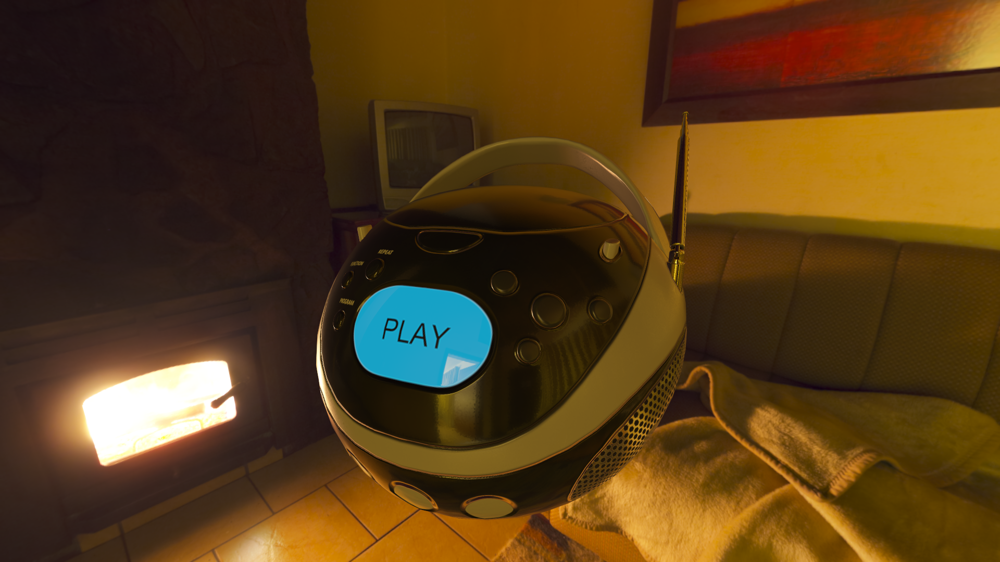
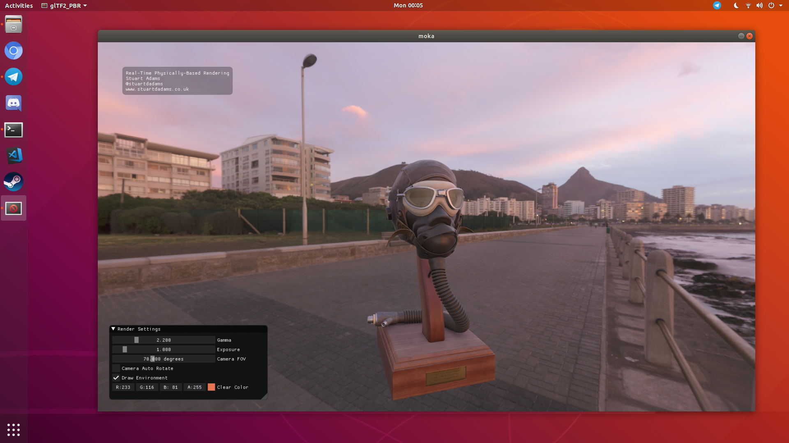

# Moka
Cross-Platform Real-Time Physically-Based Rendering for C++! glTF-friendly!

# What is this?
I developed this codebase for my Honours Project, 'Real-Time Physically-Based Rendering'. It demonstrates a microfacet-based lighting model, allowing per-fragment control over material properties such as albedo, metalness, roughness and normals. It features HDR with Gamma correction. A Cook-Torrance BRDF is implemented, respecting energy conservation and allowing fresnel reflections. Karis' split-sum approximation is used to achieve Specular Image-Based Lighting. The project is implemented on top of a custom graphics API abstraction layer, hiding the OpenGL implementation details.

The project report is included.

I wrote this code during university. If I were to come back to it I'd write a lot of it differently (this code makes some questionable allocation / OOP decisions). I don't intend to spend much time maintaining or improving this code, but I intend to keep it up in case it helps anyone who wants to mess around with PBR code.

Example Renders:

Support for Windows & Ubuntu!

